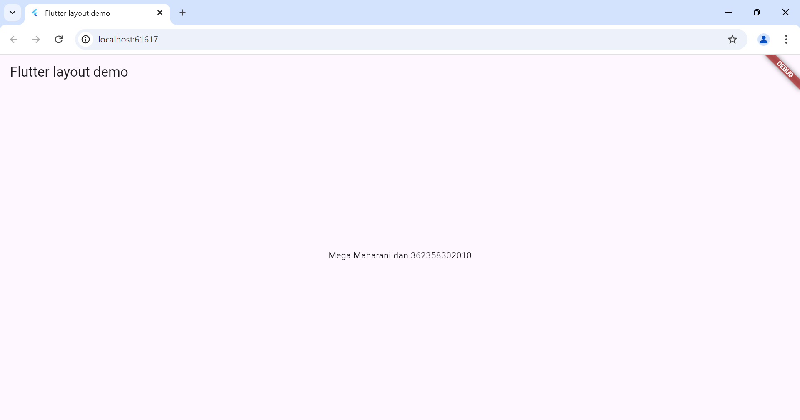
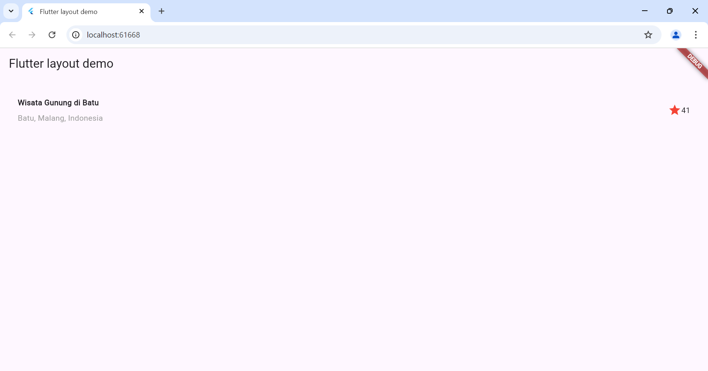
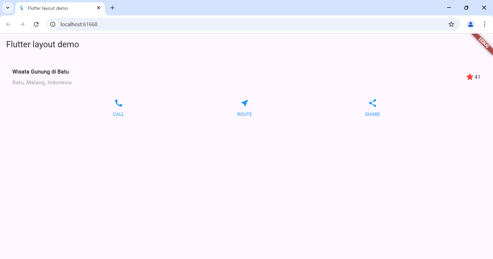
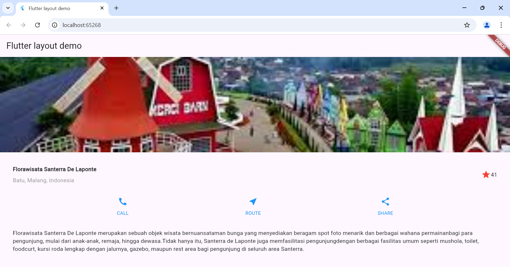

# layout_navigasi

A new Flutter project.

## Getting Started

Praktikum 1: Membangun Layout di Flutter

Langkah 1:
Buat project baru

langkah 2: buka file lib/main.dart
ganti di text title 

Langkah 3: implementasi title row

Praktikum 2: Implementasi button row

langkah 1: buat method Column_buildButtonColumn
Langkah 2: buat widget buttonSection
Langkah 3: tambahkan button section ke body

Praktikum 3: Implementasi text section

Langkah 1: buat widget textSection
Langkah 2: tambahkan textSection ke body

Praktikum 4: Implementasi image section

Langkah 1: buat folder images kemudian set ke file pubspec.yml
Langkah 2: kemudian tambahkan aset gambar ke body
Langkah 3: atur menjadi ListView

